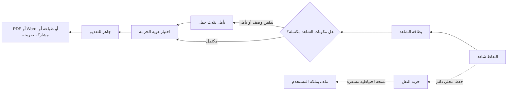

# مقترح UI/UX للميزة التنافسية طويلة المدى

**المنتج:** خبير الشواهد  
**مبدأ التصميم:** «وثّق بثقة، اعرف ما ينقصك، ثم أخرج ملفًا يليق بإنجازك.»  
**القيد غير القابل للتفاوض:** Local-first؛ لا حسابات إلزامية، لا رفع تلقائي، ولا قاعدة بيانات سحابية في المسار الأساسي.

## الملخص التنفيذي

الميزة التنافسية لا تحتاج شاشة تحليلات كبيرة أو مساعدًا سحابيًا معقدًا. الأفضل هو تحويلها إلى **ثلاثة إحساسات يلمسها المستخدم في كل رحلة**: أن الشاهد منظم، وأن بياناته آمنة ومحلية، وأن ملفه النهائي يبدو رسميًا من دون أن يصبح خبير تصميم. لذلك يقترح هذا المستند طبقة واجهة خفيفة فوق المسار الحالي، لا مسارًا جديدًا يربك المعلم.

| الركيزة التنافسية | الترجمة في الواجهة | ما لا نفعله |
|---|---|---|
| فهم سير العمل المهني العربي | بطاقة شاهد وسياق تأمل موجز وقوالب دور محلية | لا نفرض نموذجًا طويلًا أو معايير أداء مركزية. |
| الثقة في Local-first | حالة حفظ محلي ونسخ احتياطي ومشاركة صريحة | لا نستبدلها بحساب أو مزامنة صامتة. |
| مخرجات مدرسية مهنية | معاينة «جاهز للتقديم» وهوية دور/مدرسة منظمة | لا نفتح محرر تصميم كامل أو إعدادات كثيرة. |

## 1. لغة التجربة المقترحة

تظل رحلة الخمس خطوات كما هي. التغيير هو أن كل خطوة تمنح المعلم **قرارًا واحدًا واضحًا** ومعلومة واحدة عن التقدم. يستبدل مفهوم «الذكاء» الغامض بمفهوم عملي هو **التوجيه المحلي**: قواعد قصيرة تشرح إن كان الشاهد صالحًا للتقديم وما الذي ينقصه، من دون تقييم المعلم أو إرسال نصه إلى أي جهة.

> **قاعدة التصميم:** لا تظهر ميزة جديدة إلا إذا أجابت عن أحد الأسئلة الثلاثة: «ماذا أفعل الآن؟»، «هل بياناتي آمنة؟»، أو «هل ملفي جاهز للتقديم؟».

### شريط الحالة الدائم — «محفوظ على جهازك»

يظهر أسفل الشريط العلوي الثابت سطر مصغر قابل للضغط، وليس بطاقة كبيرة: أيقونة قفل خفيفة، وعبارة مثل «محفوظ محليًا · آخر حفظ الآن». عند الضغط يفتح **لوح اطمئنان البيانات**.

| حالة | النص المقترح | الإجراء الوحيد |
|---|---|---|
| حفظ طبيعي | «محفوظ على جهازك» | عرض تفاصيل النسخة والاستعادة. |
| لم تُنشأ نسخة احتياطية | «احمِ نسختك قبل تغيير الجهاز» | «إنشاء نسخة احتياطية». |
| مساحة منخفضة | «المساحة المحلية تقترب من الحد» | «مراجعة الصور». |
| دون اتصال | «تعمل دون إنترنت» | لا يحتاج المستخدم لفعل شيء. |

لا يُستخدم هذا الشريط لعرض إحصاءات أو نسبة أداء؛ فهو يؤكد الملكية والخصوصية فقط.

## 2. واجهة «بطاقة الشاهد» — قلب التجربة

بدل أن يصبح الشاهد مجرد صورة في معرض، يتحول إلى بطاقة صغيرة قابلة للقراءة في ثانيتين. تظهر بعد الالتقاط وفي صفحة الحزمة، ولا تتطلب أي خدمة خارجية.

| منطقة البطاقة | المحتوى | سلوك UX |
|---|---|---|
| رأس البطاقة | صورة مصغرة، عنوان الشاهد، ونوعه | الضغط يفتح الشاهد، لا محررًا جديدًا. |
| سطر الدلالة | «يوثق: تطوير مهني» أو «يوثق: مبادرة صفية» | اختيار فئة واحدة من شرائح كبيرة. |
| حالة الجاهزية | «مكتمل» أو «ينقصه: تأمل قصير» | ليست درجة أداء؛ هي تحقق من اكتمال مكونات الملف. |
| الإجراء | «إكمال الآن» أو «عرض في الحزمة» | زر واحد حسب الحالة. |

تظهر الجاهزية على شكل **مؤشر ثلاثي بسيط**: الشاهد، التصنيف، التأمل. لا ينبغي عرض نسبة مئوية أو لون أحمر؛ اللون المريمي يعني مكتملًا، واللون المشمشي يعني «خطوة واحدة متبقية».

```text
┌──────────────────────────────────┐
│ [صورة] شهادة حضور ورشة       مكتمل │
│ يثبت: تطوير مهني                 │
│  ● شاهد   ● تصنيف   ● تأمل        │
│                         عرض الحزمة │
└──────────────────────────────────┘
```

## 3. «تأمل بثلاث جمل» بدل محرر نص حر ثقيل

يستفيد المعلم من التأمل المنظم لكنه قد يتوقف أمام مربع فارغ. لذلك تقترح الواجهة ثلاثة أسطر قصيرة، يمكن تركها كما هي أو تحريرها:

| السؤال | نص مساعد قصير | مثال واجهة |
|---|---|---|
| ماذا فعلت؟ | صف الإجراء أو المشاركة. | «شاركت في…» |
| ما الأثر؟ | اذكر ما تغير في ممارستك أو طلابك. | «ساعدني ذلك على…» |
| ما الخطوة التالية؟ | التزام عملي اختياري. | «سأطبق… في…» |

تظهر شرائح اقتراح محلية أسفل كل سطر مثل «تنويع الاستراتيجيات» و«تحسين التفاعل» و«مشاركة الخبرة». هذه **قوالب نصية محلية** وليست توليدًا آليًا. وبهذا يحصل المستخدم على بداية قوية من دون الخوف من أن نصه أُرسل إلى نموذج خارجي.

## 4. «استوديو الهوية» المصغر — قالب مناسب للدور لا محرر تصميم

الواجهة الحالية تملك غلافًا قويًا. الخطوة التالية ليست إضافة عشرات القوالب، بل جعل الاختيار ذا معنى مهني. يظهر في خطوة الحزمة صف واحد فقط يحمل ثلاث بطاقات:

| الاختيار | الوعد البصري | الأنسب له |
|---|---|---|
| دفتر منجز | دافئ، إنساني، متوازن | ملف معلم يومي أو إنجازات متنوعة. |
| إطار رسمي | منضبط، وثائقي، واضح | تقديم رسمي أو ملف تقييم. |
| مسار الشواهد | حركي ومنظم | ملف مبادرة أو قصة نمو مهني. |

أسفل البطاقات يوجد زر **«اختيار حسب دوري»**. يفتح لوحًا سفليًا من ثلاثة خيارات فقط: «معلم/ة صف»، «معلم/ة مادة»، «منسق/ة أو قائد/ة». الاختيار يغيّر عنوان الغلاف وعبارة صغيرة وترتيب حقلين محليًا، ولا ينشئ ملف تعريف أو يطلب بيانات جديدة. يمكن للمستخدم دائمًا الرجوع إلى اختيار يدوي.

## 5. شاشة «جاهز للتقديم» — لحظة القيمة قبل التصدير

لا ينبغي أن تكون شاشة التصدير مجموعة أزرار تقنية. يقترح تحويلها إلى شاشة قرار نهائي ذات معاينة مركزية A4 وبطاقتين جانبيتين/متتاليتين على الجوال.

| العنصر | الغرض | السلوك |
|---|---|---|
| معاينة A4 مركزية | جعل المستخدم يرى شكل الملف قبل الإرسال | لمسها يكبر المعاينة فقط. |
| بطاقة الهوية | الشعاران، المدرسة، المعلم، العام | «تعديل» يفتح نفس الحقول لا شاشة إعدادات جديدة. |
| بطاقة الجاهزية | «3 شواهد · تأملات مضمّنة · الغلاف الرسمي» | تعطي ثقة، لا تحكم على الجودة. |
| شريط إخراج واحد | `PDF`، `Word`، `طباعة`، `مشاركة` | الأزرار مرتبة بحسب الاستخدام، مع PDF كزر أساسي. |

النسخة المصغرة من الشاشة على الجوال تجعل المعاينة في المنتصف، ثم زرًا أساسيًا واحدًا: **«تصدير PDF جاهز للتقديم»**. تظهر الخيارات الأخرى تحت زر «خيارات أخرى» لتجنب تشتيت المعلم غير التقني.

## 6. «خزنة النقل» — استعادة سهلة بلا سحابة

أكبر نقطة ضعف عملية في Local-first هي تغيير الجهاز أو النطاق. لذلك تقترح واجهة اسمها «خزنة النقل» داخل إعدادات العرض، لا داخل رحلة إنشاء الشاهد.

| الشاشة | المحتوى | قاعدة الأمان |
|---|---|---|
| نظرة عامة | آخر نسخة احتياطية، حجمها، وما تتضمنه | لا تعرض كلمة المرور ولا تحفظها. |
| إنشاء نسخة | اختيار كلمة مرور + شرح سطرين | الملف ينزل إلى جهاز المستخدم فقط. |
| استعادة | اختيار الملف وإدخال كلمة المرور | تعرض ملخصًا قبل الاستبدال. |
| تذكير هادئ | يظهر بعد إضافة عدة شواهد أو قبل تغيير النطاق | يمكن تأجيله؛ لا يمنع العمل. |

هذا عنصر تميّز قابل للتسويق: «بياناتك معك حتى لو تغير جهازك». لا يتطلب خادمًا أو حسابًا؛ المطلوب فقط جعل التجربة مفهومة ومرئية.

## 7. مساحة المدير: «قائمة قرار» لا لوحة مراقبة ثقيلة

تظل مساحة المدير مستقلة ومحلية. بدلاً من مضاعفة مخططات الأداء، يكون رأسها **منطقة تركيز اليوم**: عدد ملفات تحتاج متابعة، ومرشح واحد نشط، وزر استيراد.

```text
┌──────────────────────────────────┐
│ مساحة المدير المحلية              │
│  4 ملفات تحتاج متابعة   [استيراد] │
│ [الفصل الأول] [اسم المعلم] [الحالة]│
└──────────────────────────────────┘
```

يعرض الصف بطاقة معلم واحدة: الاسم، حالة المراجعة، تقدير بشري، وآخر تحديث. الضغط يفتح «ورقة قرار» جانبية تحتوي PDF والتعليق والخيارات. لا تظهر مقارنة أو ترتيب تنافسي افتراضي بين المعلمين؛ التحليل يبقى تقريرًا مخصصًا عند طلب المدير.

## 8. ذكاء اختياري بموافقة — واجهة مستقبلية لا تدخل V1

إذا قُدمت طبقة ذكاء في V3، يجب ألا تظهر كمساعد متكلم دائم. الواجهة الأفضل هي زر صغير داخل التأمل اسمه **«صقل الصياغة»**، لا «اكتب عني».

| مرحلة | تجربة المستخدم | شرط الخصوصية |
|---|---|---|
| V2 | قائمة تحقق محلية: وضوح الصورة، الفئة، التأمل، الغلاف | لا ذكاء خارجي ولا اتصال. |
| V3 اختياري | «صقل الصياغة» يعرض بديلين للنص الذي كتبه المستخدم | شاشة موافقة واضحة قبل إرسال أي محتوى خارج الجهاز. |
| بعد الاستخدام | «احتفظ بنصي» أو «استخدم المقترح» | لا حفظ للمحتوى من الخدمة دون موافقة منفصلة. |

يمنع التصميم الذكي ثلاثة أخطاء: اختراع أدلة، تقييم أداء المعلم، أو إخفاء إرسال البيانات. يعمل المنتج يدويًا بكفاءة كاملة حتى إذا لم تُفعّل هذه الطبقة.

## 9. تدفق المعلم المقترح



## 10. نظام بصري ومبادئ حركة

لا يلزم تغيير هوية «دفتر منجز». التحسين هو توزيعها بوضوح أكبر: الحبر الأزرق للقرار الأساسي، المريمي لسلامة البيانات والاكتمال، والمشمشي لخطوة واحدة متبقية. تستخدم البطاقات حدودًا لطيفة وتقوسًا متوسطًا؛ ولا تستخدم طبقات blur أو رسومًا خلفية متحركة، خصوصًا على الجوال.

| العنصر | مواصفة بسيطة |
|---|---|
| العنوان الرئيسي | 24–28px على الجوال، كلمة أو كلمتان فقط. |
| نص الحالة | 14–16px، لون داكن وتباين واضح. |
| زر القرار الأساسي | بعرض كامل في الجوال، فعل واحد محدد. |
| الحركة | 160–220ms للانتقال والضغط فقط، مع احترام تقليل الحركة. |
| البطاقات | لا أكثر من بطاقتين متنافستين في المشهد الأول. |
| الإشعارات | نصية محلية، لا تغطي زرًا أو محتوى حرجًا. |

## 11. الأولويات والتنفيذ

| الأولوية | الميزة | القيمة التنافسية | التعقيد | موضعها |
|---|---|---:|---:|---|
| P0 | شريط «محفوظ على جهازك» ولوح اطمئنان البيانات | عالٍ | منخفض | V1.1 |
| P0 | بطاقة الشاهد وحالة اكتماله | عالٍ | منخفض | V1.1 |
| P0 | تأمل بثلاث جمل وشرائح اقتراح محلية | عالٍ | منخفض | V1.1 |
| P1 | شاشة «جاهز للتقديم» المبسطة | عالٍ | متوسط | V2 |
| P1 | خزنة النقل واستعادة المدير المحلية | عالٍ | متوسط | V2 |
| P1 | اختيار هوية حسب الدور وحزم قوالب محلية | متوسط إلى عالٍ | متوسط | V2 |
| P2 | منطقة تركيز اليوم للمدير | متوسط | منخفض | V2 |
| P3 | صقل صياغة اختياري بموافقة | متوسط | مرتفع | V3 فقط |

## 12. معايير عدم التعقيد

لا يُقبل أي اقتراح إذا احتاج حسابًا، خادمًا، جدول قاعدة بيانات، أو أكثر من قرارين ظاهرين في شاشة الجوال. ولا يُقبل أي «ذكاء» إذا لم يعمل التطبيق بكفاءة تامة بدونه. تُقاس جودة الواجهة بمؤشرين بسيطين: هل يستطيع معلم جديد إنشاء PDF في أول جلسة دون مساعدة؟ وهل يستطيع شرح أين تُحفظ بياناته بجملة واحدة؟

## التوصية النهائية

ابدأ بثلاثة عناصر فقط: **بطاقة الشاهد، شريط محفوظ محليًا، وتأمل بثلاث جمل**. هذه العناصر تجعل الميزة التنافسية ملموسة داخل التجربة الحالية من دون إعادة بناء التطبيق. بعد Pilot، أضف خزنة النقل وشاشة «جاهز للتقديم» وحزم الأدوار. اترك الذكاء الخارجي والاتصال بين الأجهزة لمرحلة لاحقة وبموافقة صريحة.
